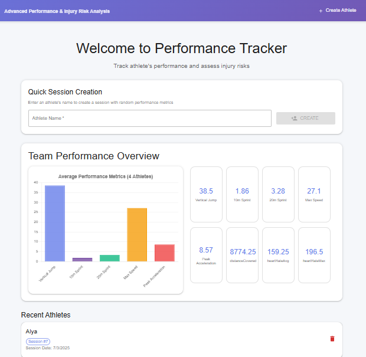

# Performance Tracker - Advanced Performance & Injury Risk Analysis

A full-stack web application that provides coaches with comprehensive performance snapshots and injury risk assessments for athletes. The system analyzes training session data and visualizes biomechanical load distribution across the athlete's body to help predict injury risks.

## Features

- **Performance Metrics Dashboard**: Track key performance indicators including vertical jump, sprint times, heart rate, and more
- **Injury Risk Visualization**: Interactive body silhouette showing load distribution across different body parts
- **Dynamic Data Generation**: Realistic mock data generation for testing and demonstration
- **RESTful API**: Clean API endpoints for session management and data retrieval
- **Responsive Design**: Modern, mobile-friendly interface built with React


### Backend
- **Node.js** - Runtime environment
- **Express.js** - Web framework
- **SQLite** - Lightweight database
- **sqlite3** - Database driver
- **CORS** - Cross-origin resource sharing

### Frontend
- **React.js** - UI library
- **React Router** - Client-side routing
- **Chart.js** - Data visualization
- **Axios** - HTTP client
- **CSS3** - Modern styling with gradients and animations

## Database Schema

The application uses a single SQLite table `PerformanceSession` with the following structure:

```sql
CREATE TABLE PerformanceSession (
  sessionId INTEGER PRIMARY KEY AUTOINCREMENT,
  playerName TEXT NOT NULL,
  sessionDate TEXT NOT NULL,
  metrics TEXT NOT NULL,           -- JSON: performance metrics
  keypointLoads TEXT NOT NULL,     -- JSON: body load distribution
  createdAt DATETIME DEFAULT CURRENT_TIMESTAMP
);
```

### Metrics JSON Structure
```json
{
  "verticalJump": 55,      // cm
  "sprint_10m": 1.8,       // seconds
  "sprint_20m": 3.2,       // seconds
  "maxSpeed": 28.5,        // km/h
  "accelerationPeak": 9.2, // m/s²
  "distanceCovered": 9500, // meters
  "heartRateAvg": 165,     // bpm
  "heartRateMax": 195      // bpm
}
```

### Keypoint Loads JSON Structure
```json
{
  "leftKnee": 85,          // Load score 1-100
  "rightKnee": 60,
  "leftAnkle": 75,
  "rightAnkle": 55,
  "lowerBack": 90,
  "leftShoulder": 45,
  "rightShoulder": 50,
  "neck": 30,
  "leftHip": 70,
  "rightHip": 65,
  "leftWrist": 25,
  "rightWrist": 30
}
```

## API Endpoints

### POST /api/sessions
Creates a new performance session with optional custom metrics or generated mock data.

**Request Body:**
```json
{
  "playerName": "John Doe",
  "metrics": {
    "verticalJump": 55,
    "sprint_10m": 1.8,
    "sprint_20m": 3.2,
    "maxSpeed": 28.5,
    "accelerationPeak": 9.2,
    "distanceCovered": 9500,
    "heartRateAvg": 165,
    "heartRateMax": 195
  }
}
```

**Note:** The `metrics` field is optional, when creating an athlete.
If provided, any missing metrics will default to 0.

If not provided, and athlete is being created from the homepage, mock data will be generated. 

**Response:**
```json
{
  "sessionId": 1,
  "message": "Session created successfully"
}
```

### GET /api/sessions/:sessionId
Retrieves complete session data including parsed JSON fields.

**Response:**
```json
{
  "sessionId": 1,
  "playerName": "John Doe",
  "sessionDate": "2025-07-02",
  "metrics": { /* performance metrics object */ },
  "keypointLoads": { /* body load object */ },
  "createdAt": "2025-07-02T10:30:00.000Z"
}
```

### PUT /api/sessions/:sessionId
Updates session data including performance metrics and player name.

**Request Body:**
```json
{
  "metrics": {
    "verticalJump": 60,
    "sprint_10m": 1.7,
    "sprint_20m": 3.1,
    "maxSpeed": 29.0,
    "accelerationPeak": 9.5,
    "distanceCovered": 9800,
    "heartRateAvg": 170,
    "heartRateMax": 200
  },
  "playerName": "Updated Player Name"
}
```

**Response:**
```json
{
  "message": "Session updated successfully",
  "sessionId": 1
}
```

### DELETE /api/sessions/:sessionId
Deletes a specific session by ID.

**Response:**
```json
{
  "message": "Session deleted successfully",
  "deletedSessionId": 1
}
```

### GET /api/sessions
Retrieves all sessions (summary view).

## Overview

### Database Design
- **SQLite**
- **JSON Storage**

### Visualization Implementation
- **CSS Positioning**: Used absolute positioning for precise placement of load indicators on the body silhouette
- **Color Coding**: Three-tier system (Green/Yellow/Red) for intuitive risk assessment
- **Interactive Elements**: Hover effects and tooltips for enhanced user experience

### Mock Data Strategy
- **Realistic Ranges**: All generated values fall within realistic athletic performance ranges
- **Consistent Units**: Standardized units across all metrics for clarity

## Installation & Setup

### Prerequisites
- Node.js (v14 or higher)
- npm or yarn package manager

### Backend Setup

1. Navigate to the backend directory:
```bash
cd backend
```

2. Install dependencies:
```bash
npm install
```

3. Initialize the database:
```bash
npm run init-db
```

4. Start the backend server:
```bash
npm run dev
```

The API will be available at `http://localhost:3001`

### Frontend Setup

1. Navigate to the frontend directory:
```bash
cd frontend
```

2. Install dependencies:
```bash
npm install
```

3. Start the development server:
```bash
npm start
```

The application will open at `http://localhost:3000`

## Usage

1. **Create a Session**: 
   - Enter an athlete's name on the home page to get the randomized metrics.
   - You can also create all athlete's performance metrics manually from "crate athlete button", Optionally fill in any performance metrics (unfilled metrics default to 0)
2. **View Analysis**: The system will use your entered data or generate mock data and redirect you to the performance snapshot
3. **Edit Data**: Click the edit button (pencil icon) to modify athlete name and performance metrics
4. **Save Changes**: After editing, click the save button (checkmark) to persist changes or cancel button (X) to discard
5. **Analyze Metrics**: Review the performance cards and bar chart for key indicators
6. **Assess Injury Risk**: Examine the body visualization to identify high-load areas
7. **Navigate Sessions**: Use the recent sessions list to view previous analyses
8. **Delete Sessions**: Click the red trash bin button on any session card or in the details view to delete unwanted sessions

## Project Structure

```
├── backend/
│   ├── controllers/
│   │   └── performanceSessionController.js   
│   ├── models/
│   │   └── performanceSessionModel.js        # Database operations for sessions
│   ├── routes/
│   │   └── performanceSessionRoutes.js       # API endpoints for sessions
│   ├── scripts/
│   │   └── initDatabase.js                   # Database initialization
│   ├── package.json
│   ├── server.js                             # Main server file 
│   └── performance_tracker.sqlite
├── frontend/
│   ├── public/
│   │   └── index.html
│   ├── src/
│   │   ├── components/
│   │   │   ├── HomePage.js
│   │   │   ├── PerformanceSnapshot.js
│   │   │   └── InjuryRiskVisualization.js
│   │   ├── App.js
│   │   ├── App.css
│   │   ├── index.js
│   │   └── index.css
│   └── package.json
├── .gitignore
└── README.md
```

## Screenshots

### Performance Dashboard


### Performance Snapshot


### Create Athlete


## Future Enhancements

- Export functionality for reports
- Filtering and search
- User authentication and roles
